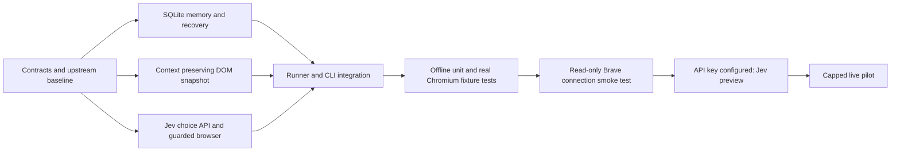

# Jev LinkedIn

Future design ideas and improvements are tracked in [TODO.md](TODO.md).

A local browser runner using **Jev for every action decision**, a context-preserving DOM extractor,
and persistent SQLite evidence. It connects to your existing Brave session in an owned background tab.
No second LLM, LinkedIn private API, generated JavaScript, or generated selectors are used.

This is a tested prototype, **not yet validated for unattended LinkedIn outreach**. Local fixture tests
exercise real Chromium and the production executor. Live Jev accuracy, role qualification and real
LinkedIn layouts still need a pilot. LinkedIn prohibits automated activity; Jev does not avoid detection.

## Task DAG



The memory, extractor and API/browser tasks were implemented by three parallel agents. See
[architecture](docs/architecture.md) for interfaces and ownership.

## Setup

Python 3.12+ and [uv](https://docs.astral.sh/uv/) are required for a fresh checkout:

```bash
uv sync --locked
cp .env.example .env
chmod 600 .env
```

An environment is already installed in this checkout. Use `.venv/bin/jev-linkedin` directly.
Set `TYPESAFE_API_KEY` in the ignored `.env`. A blank private `.env` is already provided locally.
Only the TypeSafe key is needed: text values are chosen from `text_candidates` in the task JSON.
The current Fleet and Mercor tasks leave `text_candidates` empty to disable typing entirely;
their requests omit TYPE_TEXT, type_text_target, and text_value. Restore candidates to re-enable it later.
Visible page text is sent to TypeSafe to make decisions. SQLite observations stay local in ignored `data/`.

Brave must have remote debugging enabled for its current instance. The runner reads Brave's
`DevToolsActivePort` metadata and uses a separate `BU_NAME=jev-linkedin` Harness daemon. It never
copies cookies or silently falls back to another browser. A browser authorization popup may require
manual acceptance. An explicit `BU_CDP_WS` in the environment or `.env` overrides Brave discovery.
Endpoint discovery does not prove a live connection, and an old endpoint can become stale on restart.

```bash
.venv/bin/jev-linkedin doctor
.venv/bin/jev-linkedin observe --task examples/task.json
.venv/bin/jev-linkedin preview --task examples/task.json
.venv/bin/jev-linkedin prompt --task examples/fleet.json --output data/fleet-request.json
.venv/bin/jev-linkedin prompt --task examples/mercor.json --output data/mercor-request.json
```

`doctor` checks configuration without connecting. `observe` opens an owned tab, reads a snapshot,
and closes it without clicking controls or calling Jev. `preview` additionally asks Jev for **one**
next action, but does not execute it. These commands navigate to the configured start URL.
Use a task-specific start URL (e.g. the desired company's people search) and configured search strings.

`prompt` exports the complete prepared API JSON body from a fresh browser observation, with no API call
and no page-control action. It contains page content, so store exports locally. API authentication is
never part of the export. The Fleet and Mercor examples start directly at their company pages.

The request stores the goal once in `state.task`, controls once in `state.elements`, and target choices
as references to that table. Groups keep descriptive context; represented lines are omitted from
residual page text. Duplicate groups share a reference only if profile identity agrees. Memory contains
visible profile status, recent outcomes and unfinished work, while the full ledger remains local.
“People also viewed” sections are excluded from observations and their old recommendation records
are excluded from the compact memory context. Page guards still use the full local execution evidence.

## Explicit live execution

Edit `examples/task.json` or create your own task: company, start URL, supplied text candidates,
maximum invitations, step budget, confidence threshold and no-progress limit.
Then, only for an intentionally authorized live run:

```bash
.venv/bin/jev-linkedin run --task examples/task.json --db data/mercor.sqlite --execute
.venv/bin/jev-linkedin status --db data/mercor.sqlite
```

The invitation cap is **cumulative for that SQLite ledger**, including restarts. It is not a daily reset.
Reusing the ledger preserves deduplication. Raise the explicit cap to continue after a reviewed pilot;
do not create fresh ledgers just to reset limits. Existing pending invitations do not count as newly sent.

The runner verifies an observed pending transition before counting an invitation, then requires
Pending + Follow evidence together before calling that profile complete. It stops on ambiguous sends,
low confidence, account challenges, repeated lack of progress or an exhausted step budget. Confidence
0.85 is a configurable starting threshold, **not a calibrated correctness guarantee**.

## Recovery

An intent is committed before any browser input. Dispatch failures and missing post-action observations
stay unresolved. On restart, unresolved actions stop the run before another action can be sent.
Inspect `status` and the real profile first. Manual reconciliation is available only after independent review:

```bash
.venv/bin/jev-linkedin reconcile --db data/mercor.sqlite --action-id ACTION_ID \
  --outcome verified --reason 'Inspected the actual resulting page'
```

Use `failed` only if you verified the action did not happen. Reconciliation resolves a journal entry;
it does not invent invitation evidence or increment counts. A possibly sent invitation must never
be blindly retried. Do not run two runner processes against the same ledger/browser workflow.

## How observations work

- Person cards retain names, profile URLs, visible role text and associated controls.
- Dialogs and menus receive priority; hidden/offscreen controls are excluded.
- Scrolling works on the page and nested panels, with approximately one-third viewport overlap.
- DOM node IDs are transient; profile URLs provide persistent identity.
- Guards detect changed/recycled nodes before clicking; missing content is disclosed as truncation.
- Jev receives recent action outcomes, relationship evidence and incomplete unfollow work.

The first version uses **one owned background tab with guarded Back navigation**. Separate preserved
results/profile tabs are a follow-up; Back may lose a site's scroll position. No-progress detection
bounds repeated waits/scrolls, but perfect infinite-scroll exhaustion is not claimed.

Other current limits: English relationship labels, conservative tri-state evidence, explicit ARIA
association needed for some menus, no frames/shadow DOM/canvas support, no arbitrary text generation,
and no automatic fallback model. The extractor scans the DOM and still needs performance measurements
on large live results pages. UI variations may cause a safe stop rather than successful completion.

## Validation

```bash
.venv/bin/pytest -q
.venv/bin/ruff check src tests
node --check src/jev_linkedin/snapshot.js
uv build
```

For fixture tests on a new machine, first run `.venv/bin/python -m playwright install chromium`.
Fixtures intercept all page requests; tests do not use your browser account or paid APIs.

## Attribution

Browser connection/execution and extractor design derive from Browser Use's MIT-licensed
[Jev Ultrafast](https://github.com/browser-use/jev-ultrafast). Pinned upstream reference and license
are retained under `vendor/jev_ultrafast`; see [third-party notices](THIRD_PARTY_NOTICES.md).
