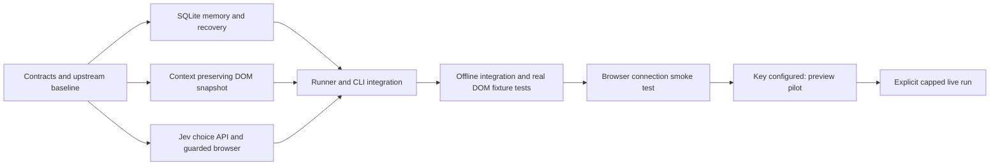

# Architecture and task DAG

Repository: jev-linkedin. Python >=3.12 package in src/jev_linkedin. Jev-only decision loop;
Browser Harness CDP connection and guarded executor adapted from browser-use/jev-ultrafast
commit 1231850a0bf1a0c0341fe408ef1668dbbfdfac46. Original reference under vendor/jev_ultrafast.
No automated outreach in development. Default preview selects an action but does not execute it.

## Shared interfaces
- memory.py: Memory(path); close(); record_observation(page); context(limit=30)->dict;
  begin_action(action,page)->str; finish_action(action_id, outcome, page=None, error=None);
  unresolved_actions()->list; invitation_count()->int. SQLite, persist before mutation.
  Observations may include profile {url,name,headline,pending,following,connected}, people list.
  Avoid claiming successful invitation solely from a click receipt. Outcomes are strings
  executed/verified/failed/uncertain/stale. Ledger completion requires pending true and following false.
- snapshot.js: self-contained JS expression returning upstream-compatible fields:
  url,title,text,w,h,scroll,actions,marker,page_key,guards. Preserve window.__jevFast node map,
  pageKey(), guard(). Add groups, people, profile, notices, truncation, scroll_regions.
  Action fields id,kind,label,node (for elements), role,href,context,rect. Kinds click/fill/select/
  scroll/wait. Scroll actions can carry node and rect for nested containers; delta numeric.
  Only exposed/visible controls. Prioritize active dialogs and main content. Budget disclosure.
- browser.py: Browser(url); observe(screenshot=False)->dict; fresh(page,action=None)->bool;
  act(action,page,text=None); close(). StalePage denotes known pre-execution staleness only.
  Constructor opens owned background tab. Keep generic CDP mutations non-retrying.
- model.py: JevClient(api_key=None, model=None); choose(page,goal,memory,text_candidates)->dict;
  returns choice (observed action id or DONE/BLOCKED), confidence, target_confidence (optional),
  text (only from supplied candidates), usage, latency_ms, operation. No fallback LLM.
  API endpoint https://api.typesafe.ai/v1/systemone; validate all consumed choice heads.
- runner.py (root agent): joins above. Journals before execution, verifies observations, stops on
  uncertainty/account warnings/cap/no progress. All actions selected by Jev, policies are guards.

## Task ownership
- memory agent: memory.py and tests/test_memory.py only.
- extractor agent: snapshot.js and tests/fixtures/* and tests/test_snapshot* only.
- integration agent: browser.py, model.py and tests/test_browser.py, tests/test_model.py only.
- root: runner, CLI, configuration, packaging, docs, integration tests and final validation.

## Build status — 2026-09-29

A–F complete: three parallel agents implemented the memory, extractor and Jev/browser components;
root integrated the runner, CLI, recovery, configuration and package. 55 tests pass, including real
Chromium fixture execution through production Browser methods. Ruff and JS syntax checks pass;
wheel and source distribution build, and snapshot.js is included in the wheel.

G connection smoke passed after an initial connection failure and a subsequent daemon startup:
Brave background tab opened the existing logged-in LinkedIn feed, observed 60 controls and 9 profile
references, and closed. No page controls clicked, no invitations sent, no Jev API calls.
No cookies, profile data, screenshots, or API keys were saved in this report.

H awaits TYPESAFE_API_KEY. I awaits a reviewed, explicitly capped pilot. The current implementation
uses one owned tab + guarded Back; the two-tab preservation design is deferred. Real LinkedIn
engineering qualification and complete send/unfollow behavior remain unverified.

## Compact request update — 2026-09-29

`prompt.py` now builds a compact model view separate from the full local execution snapshot.
`model.build_request` is pure and is shared by the API decision path and the new `prompt` CLI export.
Task instructions occur once; question heads refer to shared state. Element IDs resolve through one
control table. Identical context groups merge only when their profile identities agree; generic empty
groups disappear. Memory fetches visible profiles from the full ledger before shrinking model context.
People also viewed is excluded by the DOM reader, including offscreen heading scopes, and cannot leak
back through the compact recommendation memory. Fleet's H2 company header now stays a company group.

65 tests pass, including pruning neighbors, preserving DOM contents, recycled identities, compact
reference resolution and old visible ledger entries. Lint, JS syntax and package build pass.
Actual read-only Jev previews: Fleet 4,312 input tokens, Mercor 3,389. Chosen controls: Search more
employees and People respectively. No page-control actions were executed. Exact outgoing JSON bodies
were exported for the user. Both target confidence scores remained below the configured threshold.
One background tab remains the chosen design; revisit the separate-tabs idea only as tracked in TODO.md.
